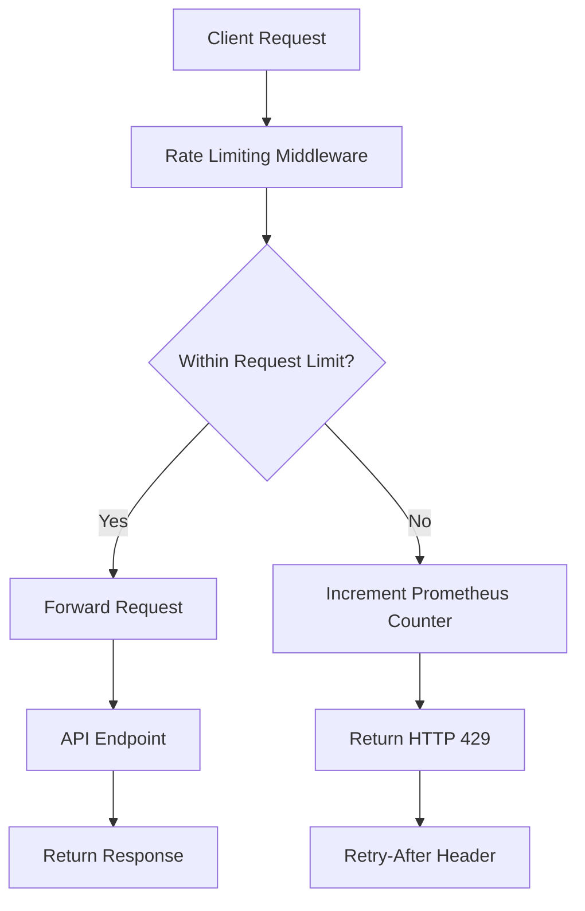
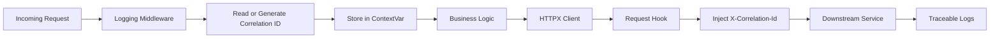
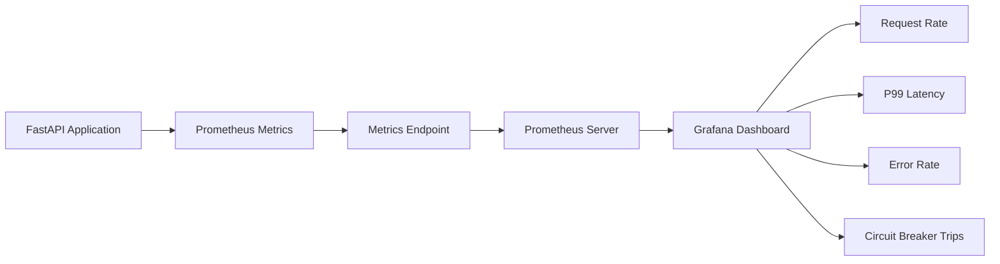
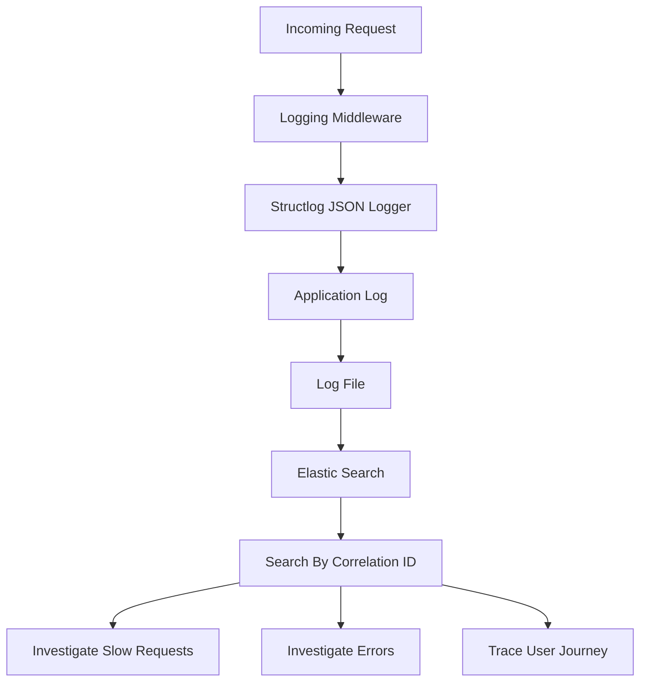
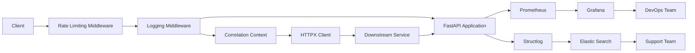

# FastAPI Middleware & Observability - Extension Tasks

## Overview

This project extends the FastAPI Middleware & Observability demo with production-grade capabilities:

* Extension A – Rate Limiting Middleware
* Extension B – Correlation ID Propagation
* Extension C – Prometheus + Grafana Dashboard
* Extension D – Structured Log Aggregation

---

# Extension A – Rate Limiting Middleware

## Objective

Protect APIs from abuse and excessive traffic by limiting requests per client IP.

## Architecture



## Implementation

### Configuration

```python
REQUEST_LOG = defaultdict(list)

RATE_LIMIT = 100
WINDOW_SECONDS = 60
```

### Prometheus Counter

```python
RATE_LIMIT_HITS = Counter(
    "rate_limit_hits_total",
    "Total requests rejected due to rate limiting"
)
```

### Middleware Logic

```python
client_ip = request.client.host
now = datetime.utcnow()

REQUEST_LOG[client_ip] = [
    ts
    for ts in REQUEST_LOG[client_ip]
    if now - ts < timedelta(seconds=WINDOW_SECONDS)
]

if len(REQUEST_LOG[client_ip]) >= RATE_LIMIT:

    RATE_LIMIT_HITS.inc()

    return JSONResponse(
        status_code=429,
        headers={"Retry-After": "60"},
        content={
            "error": "Rate limit exceeded"
        }
    )

REQUEST_LOG[client_ip].append(now)
```

---

# Extension B – Correlation ID Propagation

## Objective

Enable distributed tracing across multiple microservices.

## Architecture



## Context Variable

```python
import contextvars

correlation_id_var = contextvars.ContextVar(
    "correlation_id",
    default=None
)
```

## Store Correlation ID

```python
correlation_id = request.headers.get(
    "X-Correlation-Id",
    str(uuid.uuid4())
)

correlation_id_var.set(correlation_id)
```

## HTTPX Event Hook

```python
async def add_correlation_id(request):

    correlation_id = correlation_id_var.get()

    if correlation_id:
        request.headers[
            "X-Correlation-Id"
        ] = correlation_id
```

## HTTP Client

```python
http_client = httpx.AsyncClient(
    event_hooks={
        "request": [add_correlation_id]
    }
)
```

---

# Extension C – Prometheus + Grafana Monitoring

## Objective

Provide operational visibility and service monitoring.

## Architecture



## Metrics Monitored

| Metric                | Purpose                |
| --------------------- | ---------------------- |
| Request Count         | Traffic Monitoring     |
| Request Latency       | Performance Monitoring |
| Error Count           | Failure Monitoring     |
| Circuit Breaker Trips | Resilience Monitoring  |
| Rate Limit Hits       | Security Monitoring    |

### Request Rate

```promql
rate(http_requests_total[1m])
```

### P99 Latency

```promql
histogram_quantile(
  0.99,
  rate(
    http_request_duration_seconds_bucket[5m]
  )
)
```

### Error Rate

```promql
rate(
  payment_errors_total[1m]
)
```

### Circuit Breaker Trips

```promql
increase(
  circuit_breaker_trips_total[1h]
)
```

---

# Extension D – Structured Log Aggregation

## Objective

Centralize logs for troubleshooting and root-cause analysis.

## Architecture



## Structlog Configuration

```python
structlog.configure(
    processors=[
        structlog.stdlib.add_log_level,
        structlog.stdlib.add_logger_name,
        structlog.processors.TimeStamper(
            fmt="iso"
        ),
        structlog.processors.JSONRenderer()
    ]
)
```

## Example Log

```json
{
  "event": "request.completed",
  "correlation_id": "abc123",
  "latency_ms": 245,
  "status": 200
}
```

---

# Complete Production Architecture



---

# Validation Checklist

## Rate Limiting

* [ ] Requests under limit return HTTP 200
* [ ] Requests above limit return HTTP 429
* [ ] Retry-After header exists
* [ ] rate_limit_hits_total increments

## Correlation ID

* [ ] Correlation ID generated
* [ ] Correlation ID stored in ContextVar
* [ ] Correlation ID returned in response
* [ ] Correlation ID propagated to downstream service

## Prometheus

* [ ] /metrics endpoint accessible
* [ ] Request metrics visible
* [ ] Error metrics visible
* [ ] Rate-limit metrics visible

## Logging

* [ ] JSON logs generated
* [ ] Correlation ID present
* [ ] Latency recorded
* [ ] Searchable in Elastic

---

# Technology Stack

| Component           | Technology        |
| ------------------- | ----------------- |
| API Framework       | FastAPI           |
| Logging             | Structlog         |
| Metrics             | Prometheus        |
| Dashboard           | Grafana           |
| Retry               | Tenacity          |
| Circuit Breaker     | PyBreaker         |
| Correlation Context | ContextVar        |
| HTTP Client         | HTTPX             |
| Log Aggregation     | Elastic Search    |
| Rate Limiting       | Custom Middleware |

---

# Benefits

### Reliability

* Retry logic
* Circuit breaker protection

### Security

* Request throttling
* Abuse prevention

### Observability

* Metrics dashboards
* Distributed tracing

### Troubleshooting

* Structured logging
* Correlation-based debugging

### Scalability

* Production-ready middleware
* Microservice-friendly architecture

```
```
